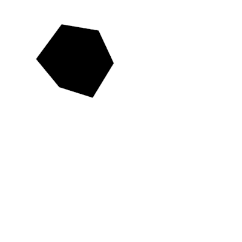
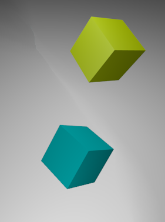

# Seam Carving

## Introduction

This project implements the method described in the paper: <http://www.cs.jhu.edu/~misha/ReadingSeminar/Papers/Avidan07.pdf>

It provides image resizing and object removal given a 2d boolean numpy array.

The energy function used is the sum of absolute difference of horizontal and vertical adjacent pixels.

## Usage

Images are represented as 3d numpy arrays. They can be read using various libraries, [OpenCV](https://pypi.org/project/opencv-python/) is used here.

This module provides two functionalities, resizing images and removing objects from a boolean mask.

### Reading Images

```python
import cv2
img = cv2.imread('test.png')
```

### Creating Seam Carve Object

```python
from seam import SeamCarve
sc_img = SeamCarve(img)
```

### Resizing

```python
sc_img.resize(new_height, new_width)
```

### Object Removal

```python
sc_img.remove_mask(mask)
```

### Retrieve Image Array

```python
sc_img.image()
```


## Example

### Resizing a 400 x 400 image to 300 x 300

```python
import cv2
from seam import SeamCarve

img = cv2.imread('test.png')

sc_img = SeamCarve(img)
sc_img.resize(new_height=300, new_width=300)


cv2.imshow('original', img)
cv2.imshow('resized', sc_img.image())
cv2.waitKey(0)
```

 

### Removing a mask

```python
import cv2
from seam import SeamCarve

img = cv2.imread('test.png')
mask = cv2.imread('mask.png', 0) != 255

sc_img = SeamCarve(img)
sc_img.remove_mask(mask)


cv2.imshow('original', img)
cv2.imshow('removed', sc_img.image())
cv2.waitKey(0)
```

 


